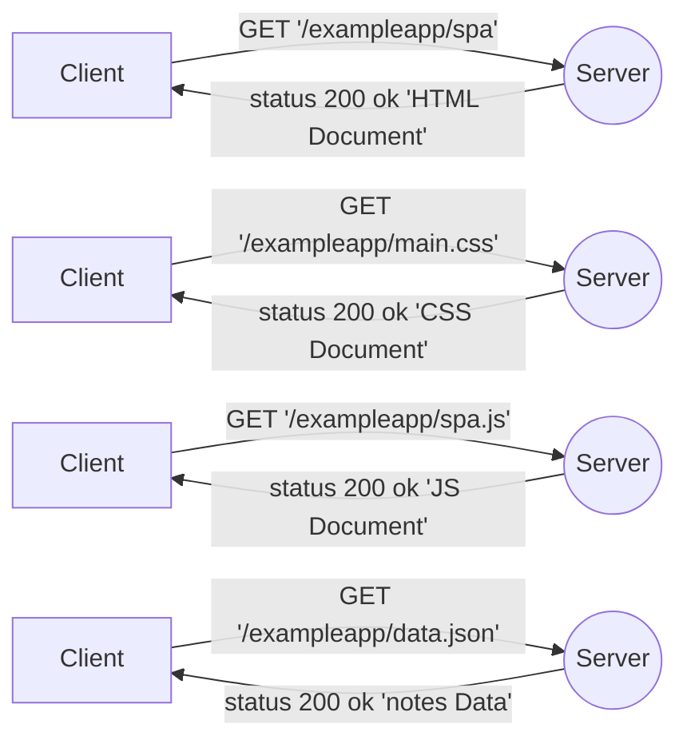

# Single page app diagram

```mermaid
graph LR
    A[Client] -->|GET '/exampleapp/spa' | B((Server))
    B -->| status 200 ok 'HTML Document' | A
    C[Client] -->| GET '/exampleapp/main.css' | D((Server))
    D -->| status 200 ok 'CSS Document' | C
    E[Client] -->| GET '/exampleapp/spa.js' | F((Server))
    F -->| status 200 ok 'JS Document' | E
    G[Client] -->| GET '/exampleapp/data.json' | H((Server))
    H -->| status 200 ok 'notes Data' | G
    
```
